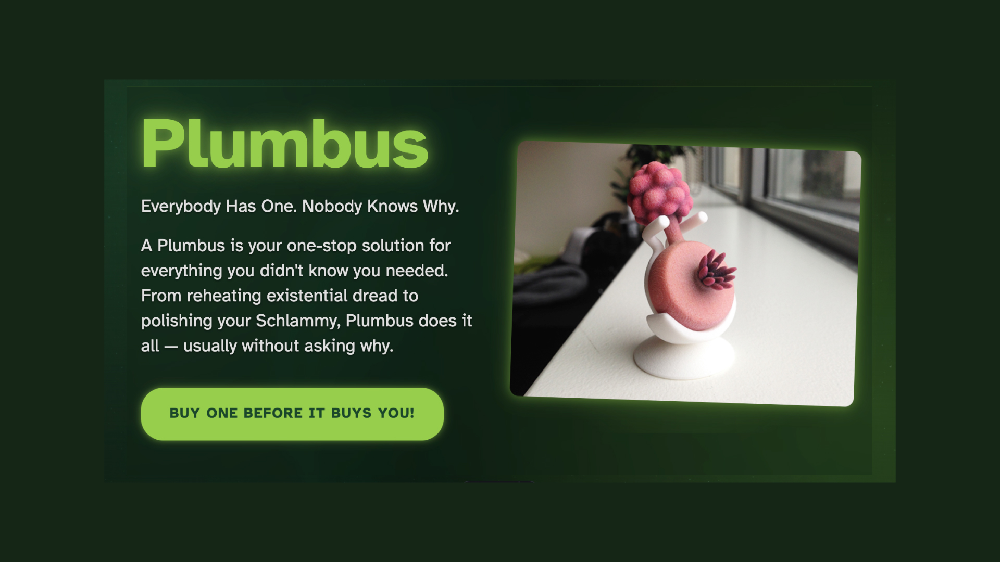
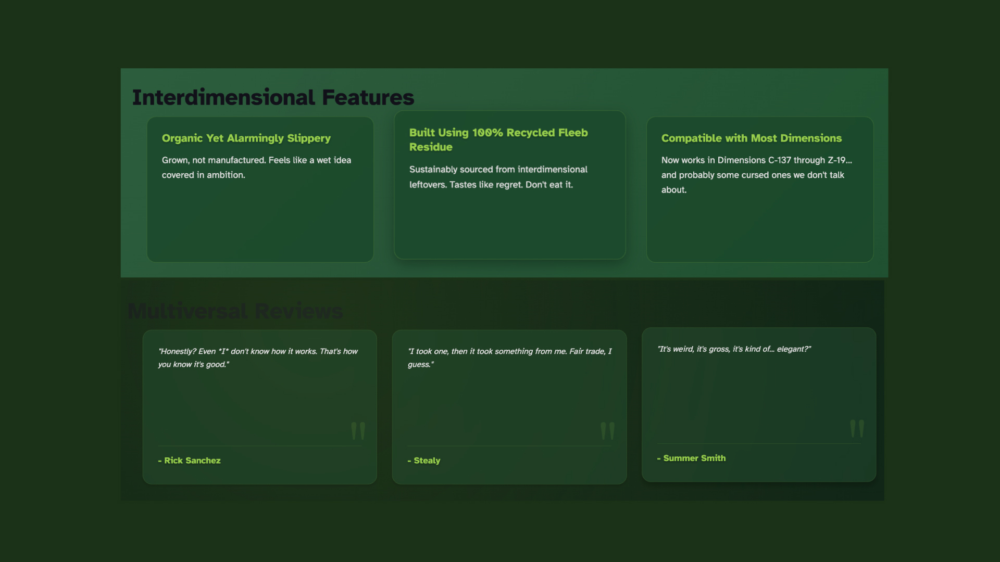
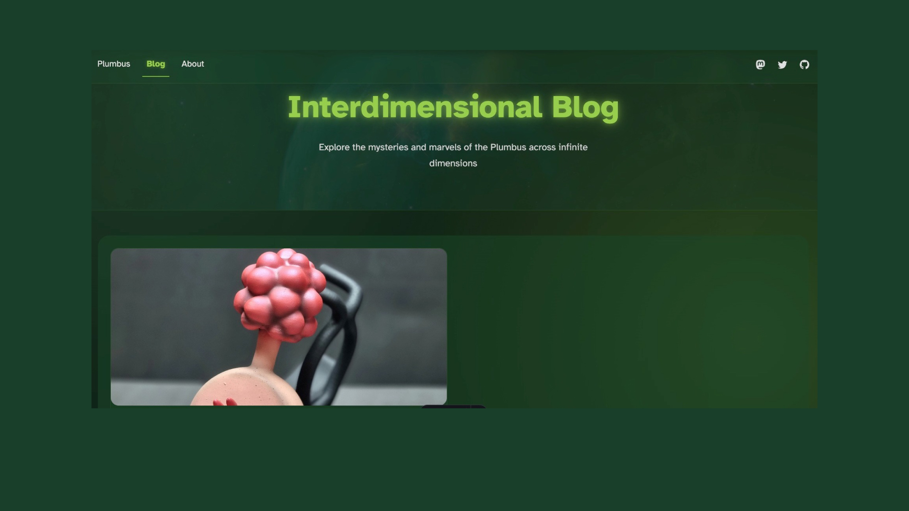
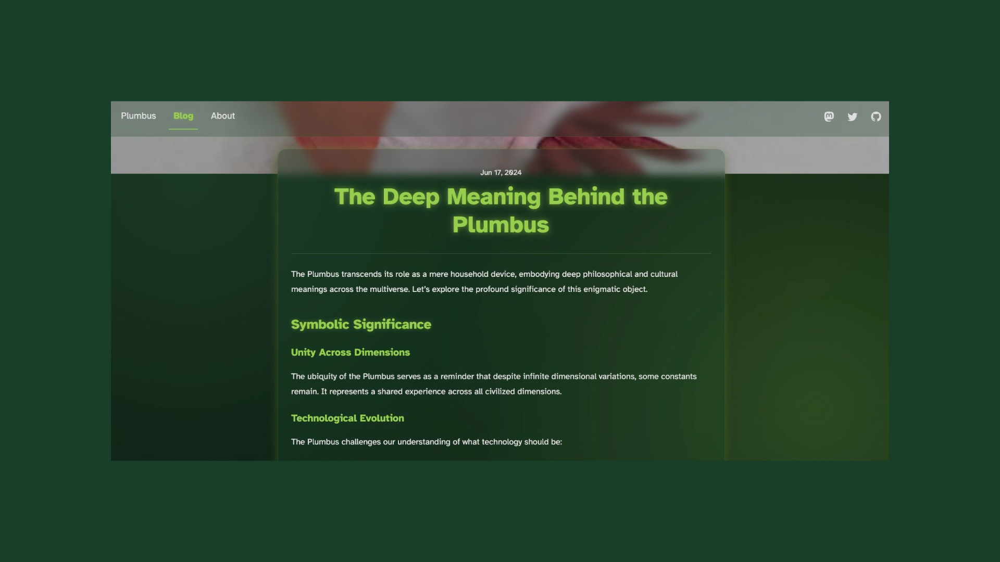

# 🌌 Plumbus Landing Page





A stunning, interdimensional landing page for the mysterious yet ubiquitous Plumbus. Built with Astro and enhanced with cosmic animations.

## ✨ Features

- 🎨 Stunning visual design with cosmic animations
- 📱 Fully responsive across all dimensions
- 🚀 Built with Astro for optimal performance
- 🌈 Interactive UI elements with portal effects
- 🔄 Dynamic content management via JSON
- 🎭 Custom animations and transitions
- 🌟 SEO optimized for interdimensional search
- 🌐 Blog section with MDX support
- 🎯 Quantum-crystalline verification system
- 🛡️ Galactic Federation compliance built-in

## 🛠 Tech Stack

- [Astro](https://astro.build) - The web framework for content-driven websites
- Modern CSS with custom properties
- Responsive images and lazy loading
- JSON-based content management
- Advanced CSS animations
- MDX for enhanced content creation
- RSS feed support
- Sitemap generation

## 🚀 Getting Started

1. Clone the repository:
```bash
git clone https://github.com/temaprint/plumbus.git
```

2. Install dependencies:
```bash
npm install
```

3. Start the development server:
```bash
npm run dev
```

4. Open your browser and visit `http://localhost:4321`

## 📁 Project Structure

```
/
├── public/
│   ├── fonts/
│   │   ├── atkinson-bold.woff
│   │   └── atkinson-regular.woff
│   └── images/
├── src/
│   ├── components/
│   │   ├── BaseHead.astro
│   │   ├── Footer.astro
│   │   ├── Header.astro
│   │   └── HeaderLink.astro
│   ├── content/
│   │   ├── blog/
│   │   │   └── *.{md,mdx}
│   │   └── data/
│   │       └── main.json
│   ├── layouts/
│   │   └── BlogPost.astro
│   ├── pages/
│   │   ├── blog/
│   │   │   └── [...slug].astro
│   │   ├── shop/
│   │   │   └── plumbus.astro
│   │   ├── about.astro
│   │   └── index.astro
│   └── styles/
│       └── global.css
└── package.json
```

## 🎨 Content Management

The site content is managed through `src/content/data/main.json`. You can easily modify:

- Product details and specifications
- Features and benefits
- Customer testimonials
- SEO metadata and social links
- Legal disclaimers
- Contact information

### Blog Posts

Blog posts are stored in `src/content/blog/` as Markdown or MDX files. Each post supports:

- Custom frontmatter
- Hero images
- Rich text formatting
- Code syntax highlighting
- Embedded components (MDX)

## 🚀 Deployment

Build the project:

```bash
npm run build
```

Preview the build:

```bash
npm run preview
```

## 🔐 Security Features

- Galactic Federation ID verification
- Quantum-crystalline authentication
- Interdimensional access controls
- Temporal paradox prevention
- Fleeb juice encryption standards

## 📝 License

MIT License - feel free to use this across any dimension

## 🌟 Credits

- Design inspired by interdimensional aesthetics
- Images sourced from various dimensions
- Built with love by the Council of Ricks
- Fleeb juice provided by certified Fleeb farmers
- Schlami testing by professional Schlamis

## 🤝 Contributing

1. Fork the repository
2. Create your feature branch
3. Commit your changes
4. Push to the branch
5. Open a pull request

### Development Guidelines

- Follow the Interdimensional Style Guide
- Test across multiple dimensions
- Verify Fleeb compatibility
- Maintain Schlami standards
- Document any temporal anomalies

## 💫 Special Thanks

Special thanks to:
- The Plumbus manufacturers
- All the Fleeb juice providers
- The Council of Ricks
- Interdimensional quality testers
- Beta dimension users
- Quantum uncertainty reducers


Remember: Every Plumbus is unique, just like the dimension it comes from!